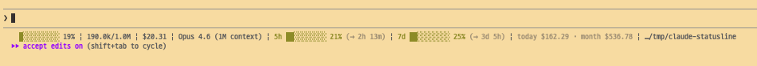

# claude-statusline

[Claude Code](https://docs.anthropic.com/en/docs/claude-code)용 실시간 상태 표시줄. 컨텍스트 사용량, 계정 쿼터, 비용을 터미널에 보여줍니다.



```
██░░░░░░░░ 19% | 190k/1M | $20.11 | Opus 4.6 | 5h ██░░░░░░░░ 21% (→ 2h 22m) | 7d ██░░░░░░░░ 25% (→ 3d 5h) | today $161.87 · month $536.37 | ~/my-project
```

## 설치

```bash
curl -fsSL https://raw.githubusercontent.com/teo-zent/claude-statusline/main/install.sh | bash
```

그다음 **Claude Code를 재시작** (종료 후 다시 열기)하세요.

> **참고:** `~/.claude/settings.json`에 기존 `statusLine` 설정이 있으면 `settings.json.backup`으로 백업한 뒤 교체합니다. 다른 설정(permissions, model 등)은 그대로 유지됩니다.

iTerm2, Terminal.app, VS Code, PyCharm, Warp, Alacritty 등 어떤 터미널이든 동작합니다. 상태줄은 Claude Code 자체가 렌더링하기 때문에 터미널 종류와 무관합니다.

## 각 항목 설명

### 컨텍스트 윈도우 — `░░░░░░░░░░ 4% | 40k/1M`

Claude는 답변할 때 이전 메시지를 전부 메모리에 유지합니다. 이것이 **컨텍스트 윈도우** — 대화의 배터리 표시기라고 생각하면 됩니다.

- `4%` = 사용 가능한 공간의 4%를 사용함
- `40k/1M` = 최대 1,000,000 토큰 중 ~40,000 토큰 사용

**왜 중요한가:** 컨텍스트가 ~90% 이상 차면 Claude가 오래된 메시지를 압축하기 시작하고, 대화 초반의 맥락을 잃을 수 있습니다. 이걸 보면 품질 저하된 응답 대신 새 세션을 시작(`/clear`)할 타이밍을 알 수 있습니다.

프로그레스 바는 사용량에 따라 색이 변합니다:
- **초록** — 70% 미만 (여유 충분)
- **노랑** — 70–90% (거의 참, 새로 시작 고려)
- **빨강** — 90% 초과 (컨텍스트 압축 발생 가능)

### 세션 비용 — `$1.53`

이 대화가 지금까지 API 기준으로 얼마를 소비했는지. Claude Code 내부 비용 추적기가 직접 보고합니다.

> Max/Pro 구독자에게는 실제 청구 금액이 아닙니다 — 정액 구독료를 내고 있으니까요. 동등한 API 사용량이 얼마인지 보여주는 겁니다.

### 모델 — `Opus 4.6`

현재 활성화된 Claude 모델. 실수로 모델이 바뀌었을 때 잡아내는 데 유용합니다 (예: `/model`로 Opus를 쓰려 했는데 Haiku로 바뀌어 있는 경우).

### 5시간 쿼터 — `5h ░░░░░░░░░░ 5% (→ 4h 28m)`

Claude Max/Pro에는 **롤링 5시간 사용 윈도우**가 있습니다. 5시간 내에 너무 많이 쓰면 속도 제한이 걸리고 응답이 느려집니다.

- `5%` = 5시간 할당량의 5%를 사용함
- `(→ 4h 28m)` = 현재 윈도우가 4시간 28분 후 리셋됨

이것은 **계정 레벨** — 모든 기기와 세션의 총 사용량이 반영됩니다.

### 7일 쿼터 — `7d ██▒▒▒░░░░░ 24% + rsv 29% (→ 3d 7h)`

구독 티어에 따른 롤링 **7일 사용 한도**.

- `██` (채워진 블록) = 실제 사용량 (24%)
- `▒▒▒` (빗금 블록) = 예약됨 — 아직 완료되지 않은 진행 중 요청이 잡아먹는 토큰
- `░░░░░` (빈 블록) = 남은 여유
- `+ rsv 29%` = 29%가 예약됨
- `(→ 3d 7h)` = 3일 7시간 후 리셋

마찬가지로 계정 레벨. 이 수치가 높아지면 쓰로틀링을 경험할 수 있습니다.

### 일간/월간 비용 — `today $65.01 · month $495.23`

이 Mac에서의 추정 비용. 로컬 세션 로그를 스캔해서 계산합니다.

- `today` = 오늘 세션들 (UTC 기준)
- `month` = 이번 달 세션들

이것은 **기기별** 집계이며, 계정별이 아닙니다. 각 기기가 자체 세션 파일을 추적합니다.

### 작업 디렉토리 — `~/my-project`

Claude Code가 작업 중인 디렉토리. 공간 절약을 위해 마지막 2단계 경로만 표시합니다.

## 비용 추산 방법론

일간/월간 비용은 Claude Code의 로컬 세션 로그(`~/.claude/projects/**/*.jsonl`)를 스캔하여 **Claude Code 자체와 동일한 가격 공식**으로 계산합니다.

[Claude Code 소스코드](https://www.npmjs.com/package/@anthropic-ai/claude-code)(`cli.js`)를 리버스 엔지니어링하여 검증했습니다:

| 모델 | Input | Output | Cache Write | Cache Read |
|------|------:|-------:|------------:|-----------:|
| Haiku 3.5 | $0.80/M | $4/M | $1/M | $0.08/M |
| Haiku 4.5 | $1/M | $5/M | $1.25/M | $0.10/M |
| Sonnet (≤200k 컨텍스트) | $3/M | $15/M | $3.75/M | $0.30/M |
| Sonnet (>200k 컨텍스트) | $6/M | $22.50/M | $7.50/M | $0.60/M |
| Opus 4, 4.1 | $15/M | $75/M | $18.75/M | $1.50/M |
| Opus 4.5+ (≤200k 컨텍스트) | $5/M | $25/M | $6.25/M | $0.50/M |
| Opus 4.5+ (>200k 컨텍스트) | $10/M | $37.50/M | $12.50/M | $1/M |

공식:

```
비용 = input_tokens/1M × inputRate
     + output_tokens/1M × outputRate
     + cache_creation_tokens/1M × cacheWriteRate
     + cache_read_tokens/1M × cacheReadRate
```

핵심 사항:
- **컨텍스트 인식 가격**: 단일 API 호출의 컨텍스트(`input + cache_read + cache_creation`)가 200k 토큰 초과 시 더 높은 요금 적용
- **스트리밍 중복 제거**: 최종 응답만 계산 (스트리밍 부분 청크는 제외)
- **서브에이전트 비용 포함**: Agent 도구 스폰은 별도 JSONL 파일에 기록되며 합계에 포함

검증 정확도: 테스트 세션에서 Claude Code 내부 `total_cost_usd` 대비 **1% 미만 오차** ($10.35 계산 vs $10.28 보고).

> 이것은 API 기준 추정치입니다. Max/Pro 구독자는 정액요금을 내므로 — 이 수치는 실제 청구서가 아니라 사용 패턴을 이해하는 데 도움을 줍니다.

## 요구 사항

| 요구 사항 | 이유 | 설치 방법 |
|-----------|------|-----------|
| **macOS** | Keychain(`security`)과 BSD `date`/`stat` 사용 | — |
| **Claude Code** | 확장 대상 CLI | `npm install -g @anthropic-ai/claude-code` |
| **jq** | 상태줄 스크립트에서 JSON 파싱 | `brew install jq` |
| **python3** | 비용 집계기 실행 | macOS에 기본 설치됨 |
| **OAuth 로그인** | 5h/7d 쿼터 표시에 필요 | `claude auth` 실행 |

> 설치 스크립트가 이 모든 항목을 자동 확인하고 누락 시 안내합니다.

## 제거

```bash
curl -fsSL https://raw.githubusercontent.com/teo-zent/claude-statusline/main/uninstall.sh | bash
```

## 작동 원리

```
Claude Code
    │
    ├─ stdin JSON ──▶ statusline.sh ──▶ 터미널 상태 표시줄
    │                     │
    │                     ├─ OAuth API (3분 캐시) ──▶ 5h/7d 쿼터
    │                     └─ cost_aggregator.py (3분 캐시) ──▶ 오늘/이번달 비용
    │
    └─ ~/.claude/projects/**/*.jsonl ──▶ cost_aggregator.py
```

- **statusline.sh**는 매 Claude 응답 후 실행 (~300ms 디바운스)
- **쿼터 API** 호출은 3분간 캐시되며 백그라운드에서 가져옴 (논블로킹)
- **비용 집계**는 세션 JSONL 파일을 스캔, 마찬가지로 3분간 백그라운드 캐시
- 캐시 파일은 `/tmp/`에 위치하며 재부팅 시 삭제됨

## 파일 구조

```
~/.claude/
├── settings.json              # statusLine 설정 (설치 시 자동 구성)
└── statusline/
    ├── statusline.sh          # 메인 스크립트
    └── cost_aggregator.py     # JSONL 로그 스캐너
```

## 문제 해결

### 상태줄이 안 보임

1. `~/.claude/settings.json`에 설정이 있는지 확인:
   ```json
   {
     "statusLine": {
       "type": "command",
       "command": "~/.claude/statusline/statusline.sh",
       "padding": 2
     }
   }
   ```
2. Claude Code를 완전히 종료 후 다시 실행.

### `5h/7d: unavailable`

- `claude auth`로 OAuth 인증을 실행하세요.
- Anthropic API가 일시적으로 속도 제한될 수 있습니다. 3분 내 자동 복구됩니다.

### `5h/7d: loading...`

첫 실행 시 정상입니다. 쿼터 데이터가 백그라운드에서 가져와지고 다음 Claude 응답 후 나타납니다.

### 비용이 $0.00으로 표시

집계기는 이번 달에 수정된 파일만 스캔합니다. 이번 달 첫 세션이라면 다음 백그라운드 새로고침 후 누적 비용이 표시됩니다.

## 라이선스

MIT
